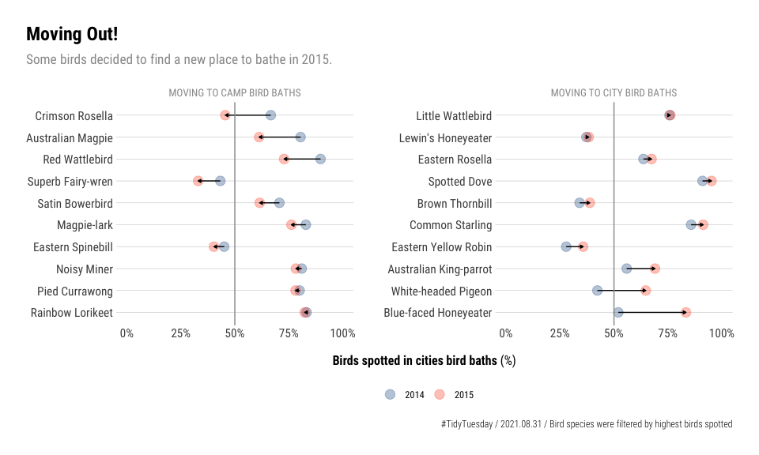

2021-08-31 TidyTuesday Birds Bath
================

### Loading Libraries

``` r
suppressMessages({
  library(tidyverse)
  library(scales)
  library(hrbrthemes)
  library(ggtext)
  library(glue)
  library(tidytuesdayR)
  library(skimr)
})
```

### Loading this week data

``` r
bird_baths <- read_csv('https://raw.githubusercontent.com/rfordatascience/tidytuesday/master/data//2021/2021-08-31/bird_baths.csv')
```

------------------------------------------------------------------------

### Data Overview

``` r
skimr::skim(bird_baths)
```

|                                                  |             |
|:-------------------------------------------------|:------------|
| Name                                             | bird\_baths |
| Number of rows                                   | 161057      |
| Number of columns                                | 5           |
| \_\_\_\_\_\_\_\_\_\_\_\_\_\_\_\_\_\_\_\_\_\_\_   |             |
| Column type frequency:                           |             |
| character                                        | 3           |
| numeric                                          | 2           |
| \_\_\_\_\_\_\_\_\_\_\_\_\_\_\_\_\_\_\_\_\_\_\_\_ |             |
| Group variables                                  | None        |

Data summary

**Variable type: character**

| skim\_variable | n\_missing | complete\_rate | min | max | empty | n\_unique | whitespace |
|:---------------|-----------:|---------------:|----:|----:|------:|----------:|-----------:|
| urban\_rural   |        169 |              1 |   5 |   5 |     0 |         2 |          0 |
| bioregions     |        169 |              1 |  12 |  24 |     0 |        10 |          0 |
| bird\_type     |          0 |              1 |   4 |  28 |     0 |       169 |          0 |

**Variable type: numeric**

| skim\_variable | n\_missing | complete\_rate |    mean |   sd |   p0 |  p25 |  p50 |  p75 | p100 | hist  |
|:---------------|-----------:|---------------:|--------:|-----:|-----:|-----:|-----:|-----:|-----:|:------|
| survey\_year   |        169 |              1 | 2014.45 | 0.50 | 2014 | 2014 | 2014 | 2015 | 2015 | ▇▁▁▁▆ |
| bird\_count    |          0 |              1 |    0.07 | 2.01 |    0 |    0 |    0 |    0 |  292 | ▇▁▁▁▁ |

------------------------------------------------------------------------

### Manipulating Data

``` r
data2plot <-
  bird_baths %>%
  filter(complete.cases(.)) %>%
  group_by(bird_type, urban_rural, survey_year) %>% 
  summarise(n = sum(bird_count)) %>%
  pivot_wider(names_from = urban_rural, values_from = n) %>%
  mutate(pct_urban = Urban/(Rural+Urban)) %>%
  filter(Urban > 0 & Rural > 0) %>%
  group_by(bird_type) %>%
  filter(n() == 2) %>%
  ungroup()
```

    ## `summarise()` has grouped output by 'bird_type', 'urban_rural'. You can override using the `.groups` argument.

-   Calculate `pct_urban` variation (delta)

``` r
my_order <-
  data2plot %>%
  mutate(survey_year = as.character(survey_year)) %>%
  select(-Rural, -Urban) %>%
  pivot_wider(names_from = survey_year, values_from = pct_urban) %>%
  mutate(delta = `2014`-`2015`)
```

-   Classifying birds (lazy way, sorry)

``` r
moving_to_city <-
  my_order %>%
  filter(delta < 0) %>%
  pull(bird_type)

moving_to_camp <-
  my_order %>%
  filter(delta > 0) %>%
  pull(bird_type)
```

-   Creating list with top 10 most spotted birds going to camp and top
    10 going to city (lazy again)

``` r
allow_list_bird_moving_to_city <-
  data2plot %>%
  filter(bird_type %in% moving_to_city) %>%
  mutate(n = Rural + Urban) %>%
  group_by(bird_type) %>%
  summarise(total_n = sum(n)) %>%
  slice_max(total_n, n = 10, with_ties = FALSE) %>%
  pull(bird_type) %>% unique()

allow_list_bird_moving_to_camp <-
  data2plot %>%
  filter(bird_type %in% moving_to_camp) %>%
  mutate(n = Rural + Urban) %>%
  group_by(bird_type) %>%
  summarise(total_n = sum(n)) %>%
  slice_max(total_n, n = 10, with_ties = FALSE) %>%
  pull(bird_type) %>% unique()
```

-   Creating final ordering

``` r
my_order <-
  my_order %>%
  filter(
    bird_type %in% c(allow_list_bird_moving_to_city, allow_list_bird_moving_to_camp)) %>%
  arrange(delta) %>%
  pull(bird_type) %>% 
  unique()
```

-   Plotting!

``` r
data2plot %>%
  filter(
    bird_type %in% c(allow_list_bird_moving_to_city, allow_list_bird_moving_to_camp)) %>%
  mutate(survey_year = as.character(survey_year)) %>%
  mutate(moving = if_else(bird_type %in% allow_list_bird_moving_to_city, 'Moving to city bird baths', 'Moving to camp bird baths')) %>%
  mutate(moving = toupper(moving)) %>%
  ggplot(aes(x = factor(bird_type, levels = c(my_order)), y = pct_urban, )) +
  geom_point(size = 4, aes(color = survey_year), alpha = .3) +
  geom_line(aes(group = bird_type), color = 'black', size = .5,
            arrow = arrow(length=unit(0.10,"cm"), ends="last", type = "closed")) +
  geom_hline(yintercept = 0.5, color = 'grey60') +
  facet_wrap(. ~ moving, scales = 'free_y') +
  scale_y_continuous(limits = c(0,1), labels = scales::percent) +
  coord_flip() +
  labs(x = NULL, y = "**Birds spotted in cities bird baths** (%)", title = "Moving Out!",
       subtitle = "Some birds decided to find a new place to bathe in 2015.",
       color = NULL,
       caption = '#TidyTuesday / 2021.08.31 / Bird species were filtered by highest birds spotted') +
  ggthemes::scale_color_calc() +
  theme(legend.position = 'bottom')
```

<!-- -->

-   Save plot

``` r
ggsave(
  filename = "tidytuesday_2021-08-31.png",
  device = "png",width = 5*2, height = 3*2, bg = '#f0eeeb')  
```
