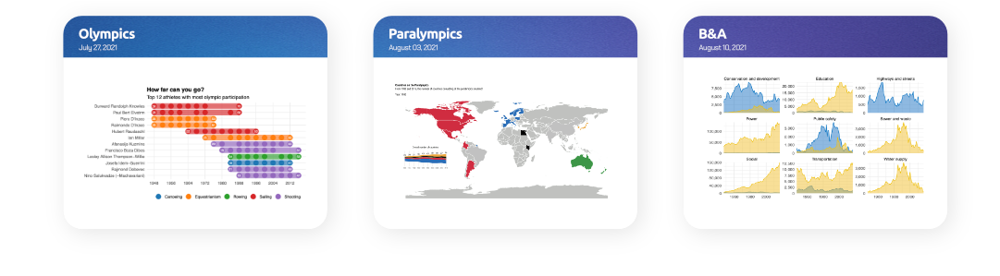
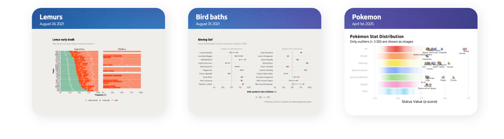

This repository contains my contributions to **[#TidyTuesday](https://github.com/rfordatascience/tidytuesday/tree/main)**, a weekly data project aimed at practicing data wrangling and visualization in R. Organized by the R for Data Science (R4DS) online community, TidyTuesday provides a new dataset each week to explore and analyze using tidyverse tools. Each entry in this repo includes code, visuals, and key insights from my exploration.

